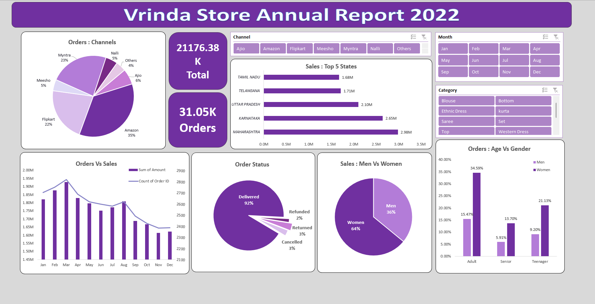

# Vrinda_Store_Dashboard
The Vrinda Store Data Analysis Dashboard is a comprehensive project developed to analyze and visualize the sales and performance data of Vrinda Store, a fictional retail business. The project focuses on leveraging Microsoft Excel to extract meaningful insights from large datasets and present them in an interactive and user-friendly dashboard.

## Project Objective :
The Vrinda Store wants to create an annual sales report for 2022. So that, the owner of the Vrinda store can understand their customers and grow more sales in 2023 & 2024.

## Key Features:
* Sales Channels:
   The "Orders: Channels" section emphasizes the contribution of different platforms, with Amazon leading at 35%, followed by Flipkart and Myntra. This breakdown showcases the significance of each channel to overall revenue.

* Geographic Insights:
The "Top 5 States" chart identifies Maharashtra as the leading state, with Karnataka, Uttar Pradesh, Telangana, and Tamil Nadu also contributing significantly to sales.

* Monthly Trends:
Combined bar and line charts visualize monthly sales patterns, helping identify peak periods and slower months for better resource planning.

* Order Status:
A detailed breakdown shows 92% of orders were successfully delivered, while the remainder were canceled, returned, or refunded, offering insights into operational efficiency.

* Demographics:
Sales distribution by gender reveals 64% of purchases were made by women and 36% by men. Additionally, insights into age groups highlight trends across adults, seniors, and teenagers.

* Product Categories:
Performance analysis of key segments like sarees, kurtas, and western dresses provides valuable data on popular products and consumer preferences.

## Conclusion :
 
#### Recommendations to Improve Vrinda Store’s Sales:

* Target women customers aged 30-49 years with tailored ads, offers, and coupons.
* Focus marketing efforts in high-performing states: Maharashtra, Karnataka, and Uttar Pradesh.
* Leverage key sales channels like Amazon, Flipkart, and Myntra for promotional campaigns.

